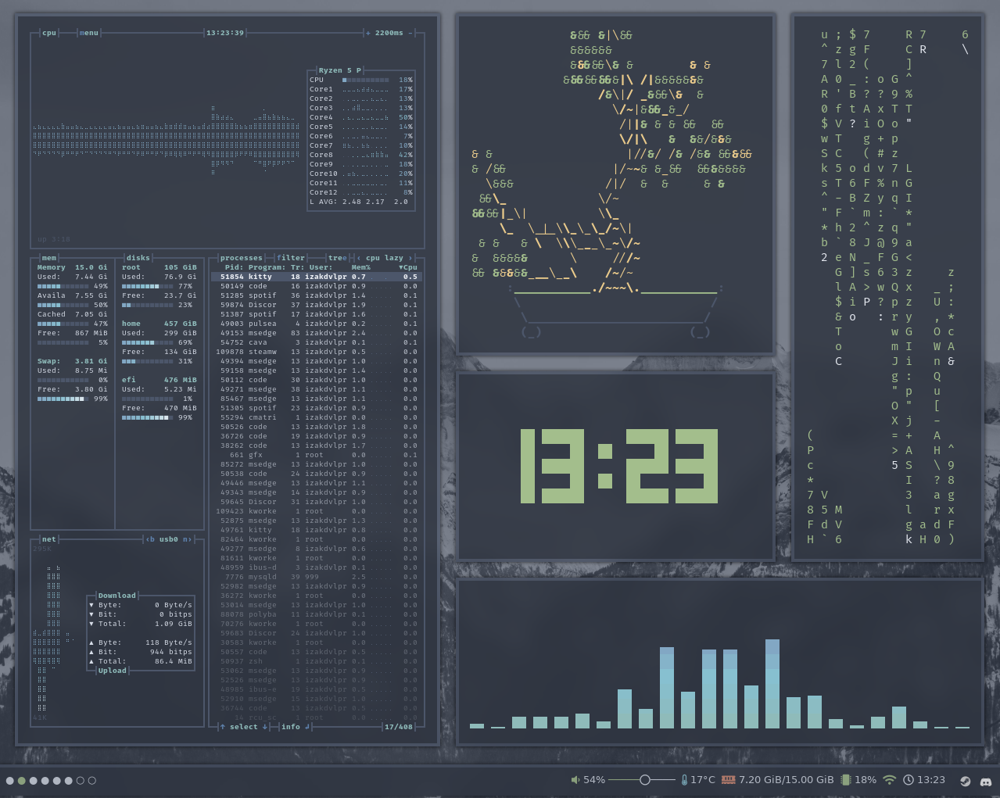

# dotfiles

📊 My personal config.

## Details

- **Font Used**: *fira code*
- **GTK Theme**: *[nordic](https://github.com/EliverLara/Nordic)*
- **Icons**: *[nordic](https://github.com/EliverLara/Nordic)*
- **OS**: *Ubuntu 22.04*
- **WM**: *[bspwm](https://github.com/baskerville/bspwm)*
- **Terminal**: *gnome terminal*
- **Shell**: *[ohmyzsh](https://github.com/ohmyzsh/ohmyzsh)*
- **Bar**: *[polybar](https://github.com/polybar/polybar)*
- **App launcher**: *[rofi](https://github.com/davatorium/rofi)*