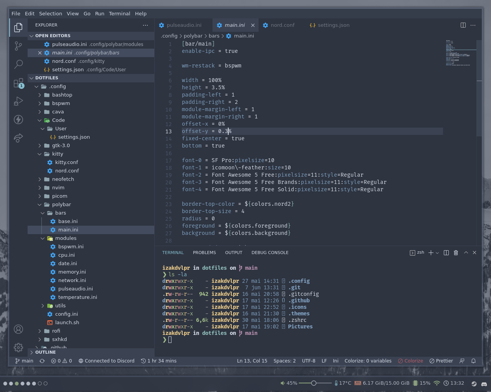
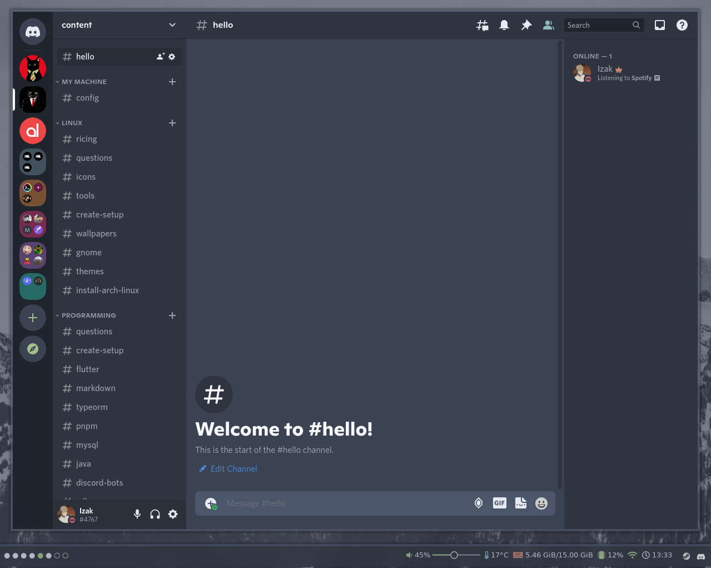

# dotfiles

📊 My personal config.

## Showcase

|edge|bashtop, cbonsai, tty-clock, cmatrix, cava|
|-|-|
|||

|vscode|discord|
|-|-|
|||

## Details

- **Font Used**: _fira code_
- **GTK Theme**: _[nordic](https://github.com/EliverLara/Nordic)_
- **Icons**: _[nordic](https://github.com/EliverLara/Nordic)_
- **OS**: _Ubuntu 22.04_
- **WM**: _[bspwm](https://github.com/baskerville/bspwm)_
- **Terminal**: _[kitty](https://github.com/kovidgoyal/kitty)_
- **Shell**: _[ohmyzsh](https://github.com/ohmyzsh/ohmyzsh)_
- **Bar**: _[polybar](https://github.com/polybar/polybar)_
- **Editor**: _[neovim](https://github.com/neovim/neovim)_ and _[vscode](https://github.com/microsoft/vscode)_
- **App Launcher**: _[rofi](https://github.com/davatorium/rofi)_
- **Compositor**: _[picom](https://github.com/yshui/picom)_
- **Browser**: _Microsoft Edge_
